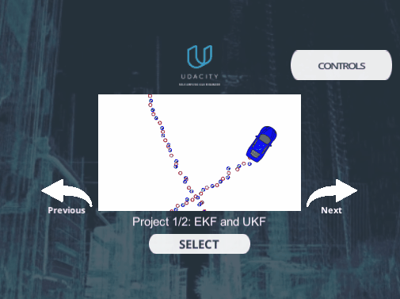

# Extended Kalman Filter Project Starter Code
Self-Driving Car Engineer Nanodegree Program

In this project I will utilize a kalman filter to estimate the state of a moving object of interest with noisy lidar and radar measurements. In the [simulator](https://drive.google.com/open?id=10J4N17bD7BhyW7ESzTaF_IUPveTBCZPn)'s Dateset1, my RMSE is `X:0.0965`, `Y:0.0854`, `VX:0.4158`,`VY:0.4321`.

## Dependencies
* ubuntu
 	* [Windows](https://www.howtogeek.com/249966/how-to-install-and-use-the-linux-bash-shell-on-windows-10/)
* cmake: 3.5
	* All OSes: [installation instructions](https://cmake.org/install/)
* make: 4.1 (Linux and Mac), 3.81 (Windows)
* gcc/g++: 5.4
* [uWebSocketIO](https://github.com/uWebSockets/uWebSockets)
	```
	git clone https://github.com/uWebSockets/uWebSockets 
	cd uWebSockets
	git checkout e94b6e1
	mkdir build
	cd build
	cmake ..
	make 
	sudo make install
	cd ../..
	sudo ln -s /usr/lib64/libuWS.so /usr/lib/libuWS.so
	sudo rm -r uWebSockets
	```
* [Term 2 Simulator](https://github.com/udacity/self-driving-car-sim/releases)
	* [Windows](https://drive.google.com/open?id=10J4N17bD7BhyW7ESzTaF_IUPveTBCZPn)

## Basic Build Instructions
Once the install for uWebSocketIO is complete, the main program can be built and run by doing the following from the project top directory.
1. Clone this repo.
2. Make a build directory: `mkdir build && cd build`
3. Compile: `cmake .. && make` 
   * On windows, you may need to run: `cmake .. -G "Unix Makefiles" && make`
4. Run it: `./ExtendedKF `

<div align=center></div>

## Communication Protocol

Here is the main protocol that main.cpp uses for uWebSocketIO in communicating with the simulator.

**INPUT**: values provided by the simulator to the c++ program

["sensor_measurement"] => the measurement that the simulator observed (either lidar or radar)

**OUTPUT**: values provided by the c++ program to the simulator

["estimate_x"] <= kalman filter estimated position x

["estimate_y"] <= kalman filter estimated position y

["rmse_x"]

["rmse_y"]

["rmse_vx"]

["rmse_vy"]

---

## Editor Settings

We've purposefully kept editor configuration files out of this repo in order to
keep it as simple and environment agnostic as possible. However, we recommend
using the following settings:

* indent using spaces
* set tab width to 2 spaces (keeps the matrices in source code aligned)

## Code Style

Please (do your best to) stick to [Google's C++ style guide](https://google.github.io/styleguide/cppguide.html).

## Generating Additional Data

If you'd like to generate your own radar and lidar data, see the [utilities repo](https://github.com/udacity/CarND-Mercedes-SF-Utilities) for Matlab scripts that can generate additional data.

